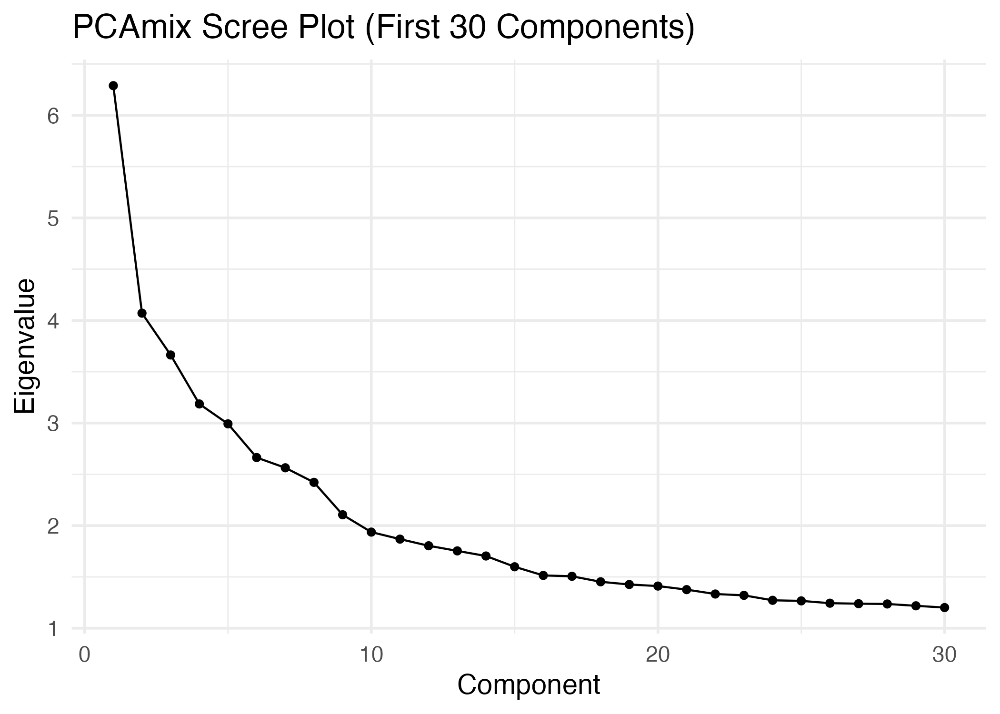
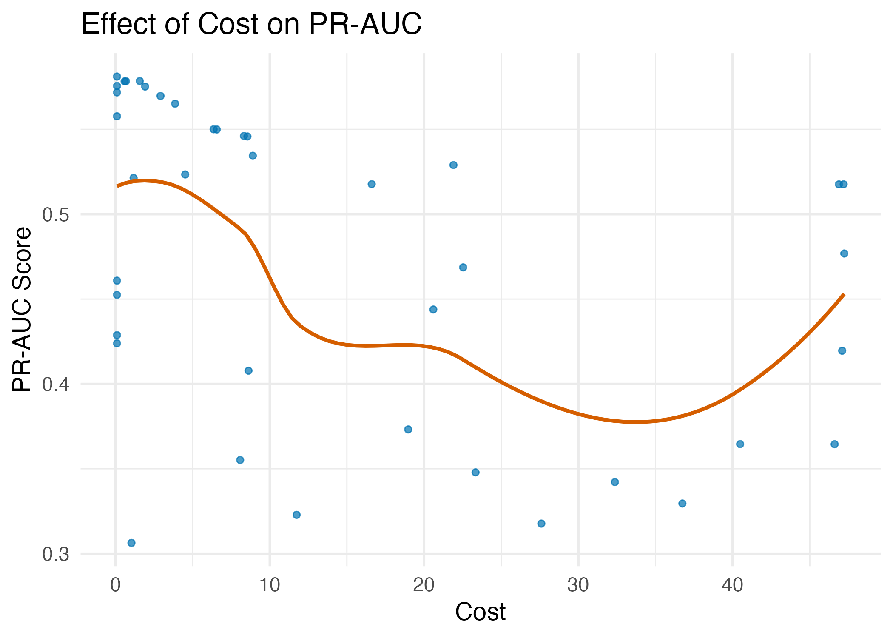
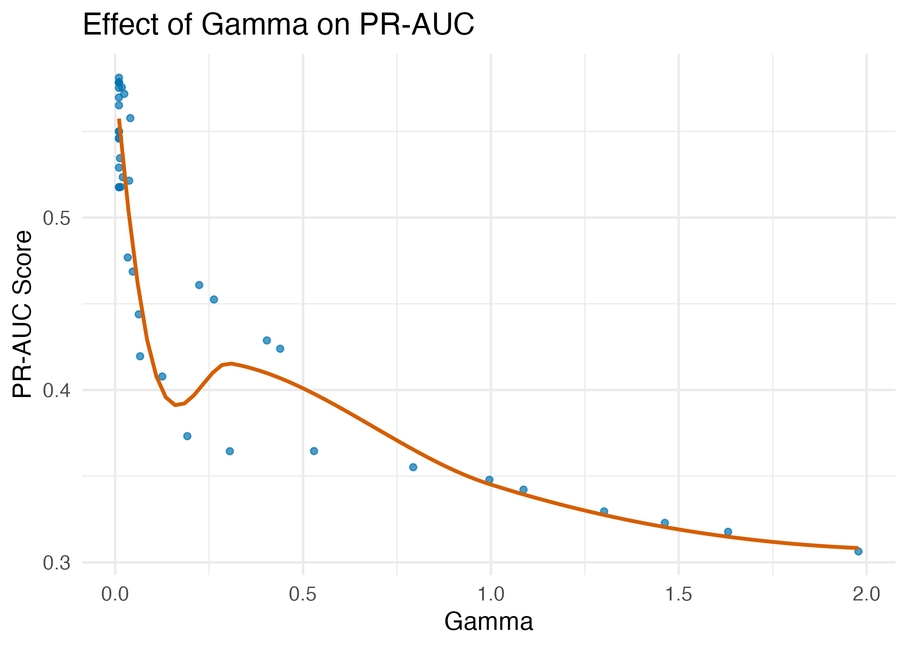
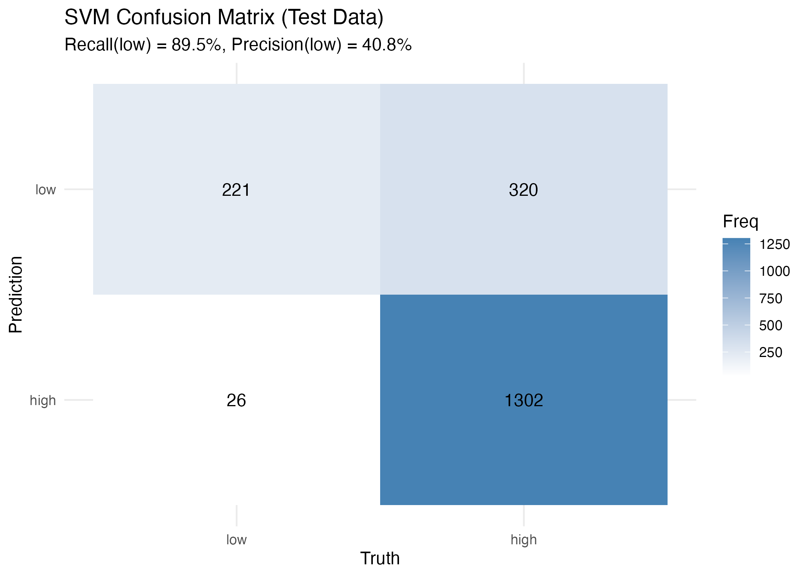
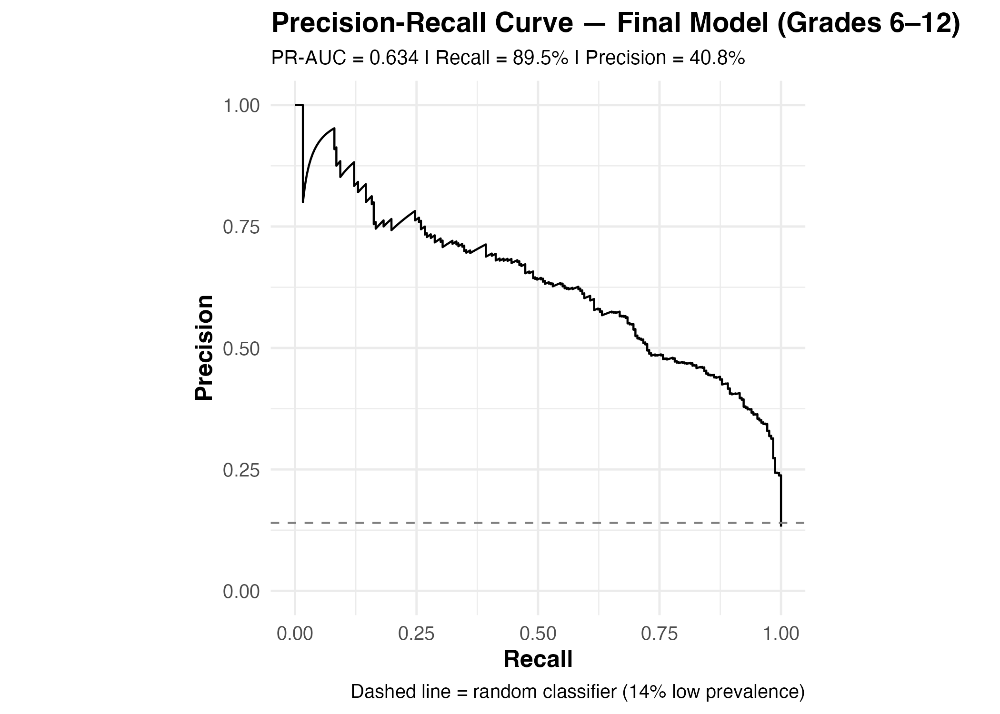
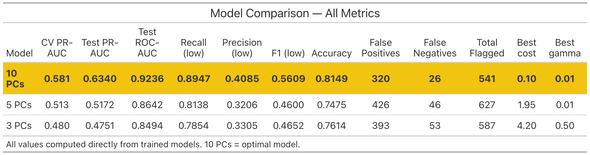

```{r setup, include=FALSE}
knitr::opts_chunk$set(echo = TRUE)
```

# Predicting Educational Success

Understanding the factors that contribute to students’ academic success has
become increasingly important, especially as schools, families, and community
partners seek effective ways to support K–12 learners. In this project, we
analyze data from the Parent and Family Involvement (PFI) in Education Survey, a
nationally representative dataset collected by the U.S. Census Bureau, to
explore relationships between family engagement, school choice, and student
academic outcomes.

Our goal is to identify which aspects of family involvement—such as
participation in school activities, communication with teachers, assistance with
homework, and perceptions of school quality—are most strongly associated with
markers of academic success. Using a range of Generalized Linear Models (GLMs)
and classification tools, including logistic regression, multinomial regression,
Poisson regression, and Linear and Quadratic Discriminant Analysis (LDA/QDA), we
aim to build predictive models that highlight the most influential variables.

By applying these statistical learning methods through the tidymodels framework,
we address the broader research question:

**Which family and school-related factors best predict student academic success, and how can these insights guide effective support strategies for K–12 students?**

The final results will be presented in a concise report that summarizes both our
modeling process and our key findings. Ultimately, our analysis is designed to
provide actionable insights for GVSU’s K–12 Connect initiative, helping inform
recommendations that support students, empower families, and strengthen
school–family partnerships.

```{r loading libraries, include=FALSE, message=FALSE, warning=FALSE}
library(tidyverse)
library(tidymodels)
library(e1071)
library(readxl)
library(dplyr)
library(ggformula)
library(naniar)
library(ggplot2)
library(PCAmixdata)
library(themis)
library(ParBayesianOptimization)
library(yardstick)
library(doParallel)
library(resample)
library(flextable)
library(officer)
library(gt)
```


# Data Loading and Preprocessing

We began by loading the 2019 Parent and Family Involvement (PFI) data from the
curated Excel file and standardizing the grade variable (ALLGRADEX) so that
Kindergarten categories were collapsed into a single value and grades 1–12 were
mapped onto a consistent 1–12 scale. From this standardized variable, we
restricted the analytic sample to high school students only (grades 6–12). Next,
we cleaned the outcome variable SEGRADES by treating special codes (-1 and 5) as
missing, dropping cases with missing SEGRADES, and then recoding SEGRADES into a
binary achievement indicator: students reporting mostly A’s/B’s (categories 1–2)
were labeled “high” and those reporting mostly C’s or lower (categories 3–4)
were labeled “low.” Finally, we removed a set of identifying or analytically
unnecessary variables (e.g., ZIP code, date of birth fields, interview
identifiers, and raw grade variables) to produce a streamlined dataset focused
on high school students and a clean binary academic success outcome.


```{r data-loading-preprocessing, include=TRUE, message=FALSE, warning=FALSE}
# Load and preprocess the data
df_2019 <- read_excel("pfi-data.xlsx", sheet = "curated 2019")

# Standardizing ALLGRADEX for 2019 data
df_2019 <- df_2019 %>%
  mutate(
    ALLGRADEX_2019raw = ALLGRADEX,
    ALLGRADEX_std = case_when(
      ALLGRADEX %in% c(2, 3) ~ 0,                       # both K flavors → Kindergarten
      ALLGRADEX >= 4 & ALLGRADEX <= 15 ~ ALLGRADEX - 3, # 1st–12th → 1–12
      TRUE ~ NA_real_
    )
  )

# Filtering for high school students only
df <- df_2019 %>%
  filter(ALLGRADEX_std >= 6 & ALLGRADEX_std <= 12)


# Handling target variable classes and missing values
df <- df %>%
  # turn -1 and 5 into NA
  mutate(SEGRADES = na_if(SEGRADES, -1),
         SEGRADES = na_if(SEGRADES, 5)) %>%

  # drop rows where SEGRADES is missing
  filter(!is.na(SEGRADES)) %>%

  # create binary target: high vs low
  mutate(
    success = case_when(
      SEGRADES %in% c(1, 2) ~ "high",
      SEGRADES %in% c(3, 4) ~ "low"
    ),
    success = factor(success, levels = c("low", "high"))
  )

# Removing all unnecessary variables
df <- df %>%
  select(-ZIPLOCL, -CDOBMM, -CDOBYY, -BASMID, -ALLGRADEX_std, -MOSTIMPT, -INTNUM, -ALLGRADEX_2019raw, -ALLGRADEX, -SEGRADES, - HHPARN19_BRD)
```

# Exploratory Data Analysis


# LDA

# Lasso Logistic Regression

# Support Vector Classification

After exploring LDA and Lasso Logistic Regression models that we examined in
class, we also wanted to implement a Support Vector Classifier (SVC) model to
further investigate the predictive power of our features on student academic
success. SVC is particularly useful for handling high-dimensional data and can
effectively capture complex relationships between variables, and we wanted to
experiment with its application in this context to see if it could yield better
classification performance compared to the statistical learning models we
tested.

We created a pipeline that includes Dimensionality Reduction using the
`PCAmixdata` package, followed by SVC modeling using the `e1071` package used in
the textbook. We tuned hyperparameters such as the cost parameter (C) and kernel
using cross-validation and parallel baysian optimization to identify the best
model using PR-AUC on the minority class as the evaluation metric using the
`ParBayesianOptimization` package.

## Data Preparation for PCAmix

Prior to fitting the PCAmix model, we undertook several preprocessing steps to
ensure compatibility with mixed-data factor extraction. In the PFI dataset, the
value `-1` indicates a *valid skip* rather than a substantive numeric response.
Because PCAmix replaces missing values in quantitative variables with the column
mean, retaining `-1` would introduce artificial values into the covariance
structure. We therefore recoded all `-1` entries in numeric variables as `NA`.

For qualitative variables, PCAmix operates on a disjunctive (indicator) matrix
in which missing entries are replaced with zeros—an interpretation consistent
with the absence of a selected response category in valid-skip cases.
Given that the dataset includes both continuous measures (e.g., household size,
work hours, parent age) and categorical survey responses, PCAmix is an
appropriate framework, as it integrates PCA for quantitative variables with an
MCA-like treatment for qualitative variables within a unified component
solution. To support this structure, we explicitly identified the small set of
metrically continuous variables and converted all remaining predictors to
factors.

After generating stratified training and test splits on the binary success
outcome, we removed the outcome variable and applied `splitmix()` to decompose
the predictor set into quantitative (`X.quanti`) and qualitative (`X.quali`)
blocks. This separation is required because PCAmix applies distinct mathematical
transformations to numeric and categorical variables, producing interpretable
mixed-data components suitable for downstream predictive modeling.

```{r data prep for PCAmix, include=TRUE, eval=FALSE}
df <- df %>%
  mutate(
    across(
      .cols = where(is.numeric),
      .fns  = ~ na_if(.x, -1)
    )
  )

num_vars <- c(
  "FHWKHRS",    # hours parent helps with homework per week
  "FSFREQ",     # frequency count of parent participation
  "HHTOTALXX",  # household size
  "P1HRSWK",    # parent's usual weekly work hours
  "P1MTHSWRK",  # months worked last year
  "P1AGE",      # parent's age
  "NUMSIBSX"    # number of siblings
)

# Convert all *non-numeric predictors* (and not success) to factors
df <- df %>%
  mutate(
    across(
      .cols = -c(all_of(num_vars), success),
      .fns  = as.factor
    )
  )

# test/train split
set.seed(1986)

data_split <- initial_split(df, prop = 0.8, strata = success)
train_data <- training(data_split)
test_data  <- testing(data_split)

# drop the outcome for PCAmix
train_x <- train_data %>% select(-success)
test_x  <- test_data  %>% select(-success)

# response vectors
train_y <- train_data$success
test_y  <- test_data$success

# training
sm_train <- splitmix(train_x)
X.quanti_train <- sm_train$X.quanti   
X.quali_train  <- sm_train$X.quali  

# testing
sm_test <- splitmix(test_x)
X.quanti_test <- sm_test$X.quanti  
X.quali_test  <- sm_test$X.quali 
```

## Scree Plot for PCAmix Components

To evaluate the dimensional structure of the mixed data, we fit a PCAmix model
using all available predictors in the training set and extracted the associated
eigenvalues. Because PCAmix yields a component for each input variable, we
examined only the first 30 components for interpretability. A scree plot was
generated to visualize the rate at which variance declines across components and
to identify potential elbows or diminishing returns in explained variance. This
diagnostic informed the subsequent decision on how many components to retain for
rotation and downstream modeling.



```{r PCAmix scree plot, include=TRUE, eval=FALSE}
pcamix_train <- PCAmix(
  X.quanti = X.quanti_train,
  X.quali  = X.quali_train,
  ndim     = ncol(train_x),
  rename.level = TRUE,
  graph = FALSE
)

k <- 30
eig <- pcamix_train$eig[1:k, ]

eig_df <- data.frame(
  Dim = 1:k,
  Eigenvalue = eig[, 1]
)

ggplot(eig_df, aes(x = Dim, y = Eigenvalue)) +
  geom_point() +
  geom_line() +
  theme_minimal(base_size = 14) +
  labs(
    title = "PCAmix Scree Plot (First 30 Components)",
    x = "Component",
    y = "Eigenvalue"
  )
```

## Selection of 10 Principal Components

Component retention was guided by inspection of the PCAmix scree plot and the
corresponding eigenvalues. The first several components show a steep decline in
eigenvalue magnitude, with Components 1–10 all exceeding approximately 1.9 and
capturing substantively meaningful variation. Beyond the tenth component, the
eigenvalues flatten markedly, ranging narrowly between 1.86 and 1.20 through
Component 30. This gradual, nearly linear decrease indicates the onset of the
“long tail” region, where additional components contribute relatively little
incremental explanatory power.

Although traditional rules such as Kaiser’s criterion (retaining components with
eigenvalues > 1) would suggest keeping many more than ten components in this
mixed-data setting, such heuristics are known to over-retain when the variable
count is large and includes categorical indicators, as in PCAmix. Instead, we
prioritized components that (a) lie above the clear elbow in the scree plot, (b)
exhibit noticeably larger eigenvalue magnitude, and (c) are likely to support
interpretable rotated factors. Under these criteria, a 10-component solution
represents a balance between parsimony and fidelity, preserving the major
dimensions of structure while avoiding inflation of weak, noise-driven
components. This 10-PC solution was therefore used for rotation, interpretation,
and downstream predictive modeling.

## Fitting PCAmix and SVC with Bayesian Hyperparameter Optimization

```{r Fitting PCAmix for 10 components, include=FALSE, eval=FALSE}
## ---- PCAmix with 10 components + Varimax rotation -------------------------
# 1. Fit PCAmix with 10 components
pcamix_train_10 <- PCAmix(
  X.quanti = X.quanti_train,
  X.quali  = X.quali_train,
  ndim = 10,
  rename.level = TRUE,
  graph = FALSE
)

# 2. TRAIN SCORES (10 PCs)
train_scores_10 <- pcamix_train_10$ind$coord
train_scores_10_df <- as.data.frame(train_scores_10)
colnames(train_scores_10_df) <- paste0("PC", 1:10)
train_scores_10_df$success <- train_y

# 3. TEST SCORES
test_scores_10 <- predict(
  pcamix_train_10,
  X.quanti = X.quanti_test,
  X.quali  = X.quali_test,
  rename.level = TRUE
)
test_scores_10_df <- as.data.frame(test_scores_10)
colnames(test_scores_10_df) <- paste0("PC", 1:10)
test_scores_10_df$success <- test_y
```


```{r Bayesian optimisation for SVC, include=TRUE, eval=FALSE}
## ---- bayesian-optimisation -------------------------------------------------
# 1. Packages ---------------------------------------------------------
library(ParBayesianOptimization)   # bayesOpt
library(e1071)                      # svm
library(rsample)                    # vfold_cv  <-- THIS IS THE FIX
library(yardstick)                  # pr_auc_vec
library(dplyr)                      # mutate, map, etc.
library(doParallel)                 # parallel backend

# 2. Parallel set-up --------------------------------------------------
cl <- makeCluster(detectCores() - 1)
registerDoParallel(cl)

# Export data + objects
clusterExport(cl, varlist = c("train_scores_10_df", "class_weights"))

# Load required packages on every worker
clusterEvalQ(cl, {
  library(e1071)
  library(rsample)      # <-- vfold_cv lives here
  library(yardstick)
  library(dplyr)
})

# 3. Scoring function (5-fold CV, PR-AUC) -----------------------------
svm_cv_score <- function(cost, gamma) {
  # Guard against illegal values
  if (cost <= 0 || gamma <= 0) return(list(Score = -Inf))

  tryCatch({
    set.seed(123)                                   # reproducible folds
    folds <- vfold_cv(train_scores_10_df, v = 5, strata = success)

    pr_vals <- numeric(nrow(folds))
    for (i in seq_len(nrow(folds))) {
      split    <- folds$splits[[i]]
      train_i  <- analysis(split)
      test_i   <- assessment(split)

      mod <- svm(
        success ~ .,
        data = train_i,
        kernel = "radial",
        cost = cost,
        gamma = gamma,
        class.weights = class_weights,
        probability = TRUE
      )

      pred <- predict(mod, test_i, probability = TRUE)
      prob_low <- attr(pred, "probabilities")[, "low"]

      pr_vals[i] <- pr_auc_vec(test_i$success, prob_low,
                               event_level = "first")
    }

    list(Score = mean(pr_vals, na.rm = TRUE))
  }, error = function(e) {
    list(Score = -Inf)      # any crash → terrible score
  })
}

# 4. Bounds -----------------------------------------------------------
bounds <- list(
  cost  = c(0.1, 50),
  gamma = c(0.01, 2)
)

# 5. Bayesian optimisation -------------------------------------------
set.seed(123)

opt <- bayesOpt(
  FUN = svm_cv_score,
  bounds = bounds,
  initPoints = 10,
  iters.n = 30,
  iters.k = 4,
  acq = "ei",
  kappa = 2.576,
  eps = 0,
  parallel = TRUE,
  gsPoints = 200,
  acqThresh = 0.9,
  errorHandling = 10,          # allow up to 10 failures
  plotProgress = TRUE,
  saveFile = "svm_bayes_opt.RDS",
  verbose = 2
)

stopCluster(cl)   # clean-up

# 6. Best parameters --------------------------------------------------
best <- getBestPars(opt)
cat(sprintf("Best cost = %.3f, gamma = %.4f, CV PR-AUC = %.4f\n",
            best$cost, best$gamma, max(opt$scoreSummary$Score)))

# 7. Final model on the *full* training set ---------------------------
final_svm_10 <- svm(
  success ~ .,
  data = train_scores_10_df,
  kernel = "radial",
  cost = best$cost,
  gamma = best$gamma,
  class.weights = class_weights,
  probability = TRUE
)

# 8. Test PR-AUC ------------------------------------------------------
test_pred <- predict(final_svm_10, test_scores_10_df, probability = TRUE)
test_prob <- attr(test_pred, "probabilities")[, "low"]

test_pr_auc <- pr_auc_vec(test_scores_10_df$success, test_prob,
                          event_level = "first")
cat("Test PR-AUC =", test_pr_auc, "\n")
```

To tune the radial-basis SVM classifier, we optimized two key hyperparameters:
**cost** and **gamma**. The *cost* parameter regulates the penalty assigned to
misclassified observations, where smaller values allow a softer and more
flexible margin, while larger values enforce stricter separation that can lead
to overfitting. The *gamma* parameter controls the width of the radial basis
function kernel. Low gamma values generate smoother, more global decision
boundaries, whereas high gamma values produce highly localized boundaries that
risk capturing noise in the training set.

Because the dataset is strongly imbalanced—with *low-success* students being far
less frequent than *high-success* students—we incorporated **class weights**
directly in the SVM optimization. We computed weights proportional to the
inverse class frequencies:

- **low**: 6.0256
- **high**: 1.0000

This weighting scheme forces the model to treat misclassification of the
minority *low* class as roughly six times more costly than misclassification of
a *high* case. Incorporating class weights prevents the classifier from
defaulting to the majority class and ensures that the decision boundary is
shaped to improve detection of the students most relevant to our prediction
objective.

Hyperparameter performance was evaluated using **five-fold stratified
cross-validation**, preserving the proportion of low and high cases in each
fold. For each (cost, gamma) pair proposed by the Bayesian optimizer, the SVM
was trained on four folds and evaluated on the remaining fold. Performance was
quantified using the **Precision–Recall Area Under the Curve (PR-AUC)** computed
for the *low* class. PR-AUC was chosen instead of ROC-AUC because the outcome is
imbalanced: PR-AUC more directly measures how well the classifier identifies and
ranks the minority group, which is the primary target for early detection and
intervention.

Bayesian optimization (using an Expected Improvement acquisition function)
efficiently searched the hyperparameter space, balancing exploration of
uncertain regions and exploitation of promising ones. The process converged on a
well-regularized configuration: **cost = 0.10** and **gamma = 0.01**, yielding a
**cross-validated PR-AUC of 0.5811**. Training a final model on the full
training set with these tuned parameters produced a **test-set PR-AUC of
0.6340**, indicating improved generalization and effective discrimination of
low-success students despite substantial class imbalance.

## Relationship Between Hyperparameters and Model Performance





The scatter plots of PR-AUC against **cost** and **gamma** reveal a clear
structural pattern in how the SVM responds to regularization. Models achieve
their strongest performance when **cost is small** and **gamma is extremely
small**, indicating that the classifier benefits from a **soft margin** and a
**very smooth, broad RBF kernel**. As either hyperparameter increases—especially
when gamma becomes moderate or large—the PR-AUC drops sharply. This pattern
shows that highly flexible or highly localized decision boundaries (high gamma
or high cost) tend to overfit the majority class and degrade ranking performance
for the minority *low-success* group. Conversely, the highest PR-AUC values
cluster in the region where the boundary is simple and heavily regularized,
consistent with the final optimal configuration (cost = 0.10, gamma = 0.01).

## SVM Confusion Matrix on Test Data

```{r SVM Confusion Matrix, include=FALSE, eval=FALSE}
# Add predictions to test data
test_scores_10_df$pred <- predict(final_svm_10, test_scores_10_df)

# Confusion matrix plot
test_scores_10_df %>%
  conf_mat(truth = success, estimate = pred) %>%
  autoplot(type = "heatmap") +
  scale_fill_gradient(low = "white", high = "steelblue") +
  labs(title = "SVM Confusion Matrix (Test Data)",
       subtitle = "Recall(low) = 89.5%, Precision(low) = 40.8%") +
  theme_minimal()
```



The confusion matrix displays predicted classes on the rows and true classes on
the columns. Thus, each cell reflects how often the model assigned a given label
relative to the actual outcome.

- **Predicted low / True low (TP)**: 221
- **Predicted low / True high (FP)**: 320
- **Predicted high / True low (FN)**: 26
- **Predicted high / True high (TN)**: 1302

Interpreting *low* as the at-risk (positive) class:

- **Recall (sensitivity)** = 221 / (221 + 26) ≈ **89.5%**  
  - The model correctly identifies most low-success students and rarely misses them.
- **Precision** = 221 / (221 + 320) ≈ **40.8%**  
  - Of all students predicted to be low-success, only about 41% actually are; the remainder are false alarms.
- **Overall accuracy** ≈ (221 + 1302) / (221 + 320 + 26 + 1302) ≈ **81.5%**



The precision–recall curve illustrates how the model balances correctly
identifying low-success students (recall) against the proportion of flagged
students who are truly low-success (precision). The model achieves strong recall
across most thresholds, reflecting its ability to detect the majority of at-risk
students, while maintaining precision well above the random-chance baseline of
14%. The resulting PR-AUC of 0.634 indicates substantially better minority-class
ranking performance than would be expected by chance.

These results indicate that the model is optimized toward **high recall for the
low-success group**, which aligns with the project goal of minimizing false
negatives (i.e., failing to detect at-risk students). The tradeoff is a higher
false-positive rate, meaning some high-success students are flagged as low. This
pattern is consistent with the class weighting and the PR-AUC–driven tuning
procedure, which prioritize identifying as many at-risk students as possible.

Importantly, in an educational context, the “cost” of these false positives may
not be strictly negative. Students incorrectly flagged as low-success may still
benefit from additional academic support, mentoring, or resource allocation. Such
interventions can reinforce positive behaviors, bolster engagement, and help
counteract patterns associated with multigenerational academic disadvantage. Thus,
while the model errs on the side of over-identification, this may serve a broader
equity-oriented purpose by expanding access to supportive structures that promote
long-term success.

## Comparison of Alternative SVM Models

To assess the stability of predictive performance across different levels of
dimensionality reduction, we estimated three SVM models using PCAmix solutions
with 10, 5, and 3 principal components. Across all metrics, the **10-component
model** demonstrated the strongest performance. It achieved the highest
cross-validated PR-AUC (0.581), the highest test PR-AUC (0.634), and the highest
ROC-AUC (0.924). This model also delivered the strongest recall for the
low-success group (0.895), indicating that it most effectively identifies
at-risk students. Although it produced more false positives than the more
compact models, it maintained the lowest number of false negatives—consistent
with its design objective of maximizing early detection.

The **5-component model** exhibited moderate performance, with a test PR-AUC of
0.517 and a noticeable decline in ROC-AUC and overall accuracy. Its recall for
the low-success group dropped to 0.814, and the number of false negatives nearly
doubled relative to the 10-component model. Despite flagging more students
overall, its precision remained lower, suggesting weaker minority-class ranking
ability.

The **3-component model** performed the weakest of the three. With a test PR-AUC
of 0.475 and the lowest ROC-AUC (0.849), this model struggled to separate low-
and high-success students. Recall fell to 0.785, and false negatives increased
to 53. Although it produced fewer false positives than the 5-component model,
its lower discriminative performance suggests that substantial predictive signal
was lost when reducing the dimensionality to three components.
Overall, the comparison indicates that reducing the PCAmix representation too
aggressively degrades minority-class detection and ranking quality. The
**10-component model** offers the most balanced and effective performance,
preserving enough mixed-data structure to support high recall and strong PR-AUC
while maintaining acceptable precision and accuracy.




